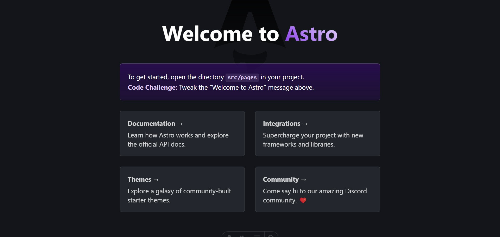
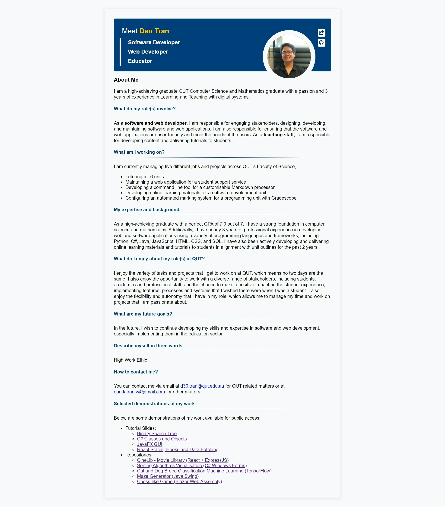
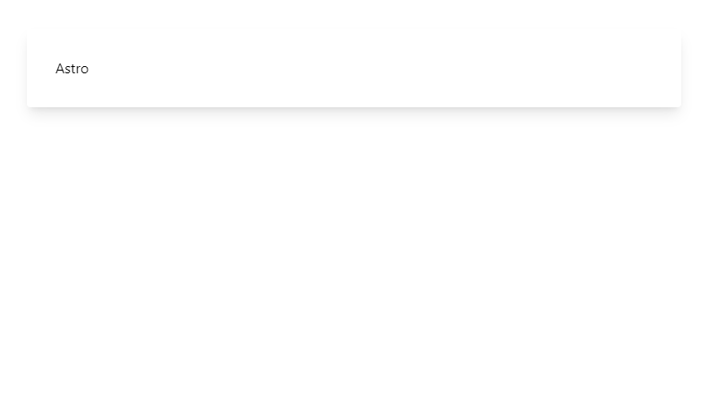

# Astro for a profile site

This document records how I used Astro to build my profile site, and it's a work in progress. I am still learning Astro and will update this document as I learn more.

{{ toc }}

## References

I found the following resources helpful:

- [Astro documentation](https://docs.astro.build/)

## Getting started

### Development environment

I am using VS Code as my editor, and installed the following extensions for Astro and Tailwind CSS:

- [Astro](https://marketplace.visualstudio.com/items?itemName=astro-build.astro-vscode)
- [Tailwind CSS IntelliSense](https://marketplace.visualstudio.com/items?itemName=bradlc.vscode-tailwindcss)

### Installation

I started by creating a new directory, and using Astro's setup wizard to create a new project.

```bash
mkdir profile
cd profile
npm create astro@latest
```

And used the default settings (except for `templ`):

- `dir`: `./`
- `tmpl`: Empty
- `ts`: Yes (for TypeScript)
- `use`: Strict
- `deps`: Yes
- `git`: Yes

To start the development server, I ran:

```bash
npm run dev
```

Which gives me a URL to view the site locally:



I am also interested in using Tailwind CSS, so I installed it:

```bash
npx astro add tailwind
```

Which added the necessary dependencies to the project, including a `tailwind.config.js` file.

### Folder structure

By default, Astro creates the following folder structure:

```
/
├── public/
├── src/
│   └── pages/
│       └── index.astro
└── package.json
```

| Folder | Description |
| --- | --- |
| `public/` | Contains the public assets, such as images |
| `src/` | Contains the source code |
| `src/pages/` | Contains the pages of the site |

## Building a single page

As a first step, I want to recreate my (very) simple bio page, but using Astro.



This will be done through updating the `src/pages/index.astro` file, which currently contains:

```astro
---

---

<html lang="en">
	<head>
		<meta charset="utf-8" />
		<link rel="icon" type="image/svg+xml" href="/favicon.svg" />
		<meta name="viewport" content="width=device-width" />
		<meta name="generator" content={Astro.generator} />
		<title>Astro</title>
	</head>
	<body>
		<h1>Astro</h1>
	</body>
</html>
```

### Defining a Layout

To keep this page minimal, I create a layout in `src/layouts/DefaultLayout.astro` with some basic styling:

```astro
<html lang="en">
	<head>
		<meta charset="utf-8" />
		<link rel="icon" type="image/svg+xml" href="/favicon.svg" />
		<meta name="viewport" content="width=device-width" />
		<meta name="generator" content={Astro.generator} />
		<title>Astro</title>
	</head>
  <body class="flex justify-center">
    <div class="shadow-lg w-[750px] p-8 m-8 rounded">
      <slot />
    </div>
  </body>
</html>
```

And updated the `src/pages/index.astro` file to use this layout:

```astro
---
import DefaultLayout from '../layouts/DefaultLayout.astro'
---

<DefaultLayout>
  <h1>Astro</h1>
</DefaultLayout>
```

This gives me a simple page with a heading:



### Creating the header

Now, I will add a header to the page that contains my name, a picture and a short description, like so:


Since I will need to use some icons, I will need to install [`astro-icon`](https://www.astroicon.dev/getting-started/):

```bash
npx astro add astro-icon
```

Then install the Material Design icons:

```bash
npm install @iconify-json/mdi
```

This seems like a good opportunity to create a component for the header, so I create a new file `src/components/profile/Header.astro`:

```astro
---
import { Icon } from 'astro-icon/components';
---

<div class="flex flex-row bg-blue-950 p-6 text-white justify-between rounded mb-10">
  <div class="flex flex-col gap-2">
    <p class="text-2xl">Meet <span class="text-yellow-400 font-semibold">Dan Tran</span></p>
    <div class="border-l-4 pl-6 font-medium">
      <p>Software Developer</p>
      <p>Web Developer</p>
      <p>Educator</p>
    </div>
  </div>
  <div class="flex gap-2">
    
    <div class="flex flex-col gap-1">
      <div class="icon">
        <Icon name="mdi:share" size={24}/>
      </div>
      <div class="icon">
        <a href="https://github.com/autumnssuns" target="_blank">
          <Icon name="mdi:github" size={24}/>
        </a>
      </div>
    </div>
  </div>
</div>

<style>
  .icon {
    @apply bg-white text-blue-950 rounded hover:bg-blue-400 hover:text-white hover:cursor-pointer;
  }
</style>
```

And import the component in the `src/pages/index.astro` file:

```astro
---
import DefaultLayout from '../layouts/DefaultLayout.astro'
import Header from '../components/profile/Header.astro'
---
<DefaultLayout>
  <Header />
</DefaultLayout>
```

Since the header uses an image, I need to add an image to the `public/images` folder, called `avatar.jpg`.

This gives me a header with my name, a picture and some icons:


The colours are not quite right, but it looks good enough for now.

### Creating the body

The body will contain information about myself. Since this will be frequently updated, I would like to write it in Markdown.

To allow Tailwind CSS to work with Markdown, I need to install `@tailwindcss/typography`:

```bash
npm install -D @tailwindcss/typography
```

And add it to the `tailwind.config.js` file, under `plugins`:

```js
require('@tailwindcss/typography')
```

To apply `@tailwindcss/typography`, I need a new layout, called `src/layouts/ProseLayout.astro`:

```astro
<div class="prose prose-headings:text-blue-900 max-w-full prose-hr:bg-gradient-to-r prose-hr:from-white prose-hr:via-blue-900 prose-hr:to-white prose-hr:h-[2px]">
  <slot/>
</div>
```

And the body content in `src/components/profile/Body.astro`, making sure to import the `ProseLayout`:

```astro
---
layout: ../../layouts/ProseLayout.astro
---

# About me

I am a high-achieving graduate QUT Computer Science and Mathematics graduate with a passion and 3 years of experience in Learning and Teaching with digital systems.
```

And import the component in the `src/pages/index.astro` file:

```astro
---
import DefaultLayout from '../layouts/DefaultLayout.astro'
import Header from '../components/profile/Header.astro'
import Body from '../components/profile/Body.md'
---
<DefaultLayout>
  <Header />
	<Body />
</DefaultLayout>
```

This gives me a header and body:


To complete the page, I can just simply update the `components/profile/Body.astro` file with more information.

Finally, I'll add a background image to the page to make it look a bit more interesting. I'll add the image to the `public/images` folder, called `background.jpg`.

To allow Tailwind CSS to work with images, I need to add the following to the `tailwind.config.js` file, under `theme`:

```js
extend: {
  backgroundImage: {
    'default': "url('/images/background.jpg')",
  },
},
```

Then I can update the `body` tag in the `src/layouts/DefaultLayout.astro` file to use the background image (and make some styling changes to work with the image):

```astro
<body class="flex justify-center bg-default bg-cover bg-fixed">
  <div class="p-8 m-8 max-w-[950px] rounded bg-white shadow-blue-900 shadow-lg">
    <slot />
  </div>
</body>
```

### Deploying the site to GitHub Pages

Here I'm following the guide on [Deploying to GitHub Pages](https://docs.astro.build/en/guides/deploy/github/).

First, update the `astro.config.mjs` file to include the `site` and `base` options:

```js
import { defineConfig } from 'astro/config'

export default defineConfig({
  site: 'https://autumnssuns.github.io',
  base: 'astro-profile',
})
```

This kind of broke my images, so I had to update the paths in the `src/components/profile/Header.astro` and `tailwind.config.js` files to include the base path, i.e. `/astro-profile/images/avatar.jpg` instead of `images/avatar.jpg`.

In the future, I plan to migrate this project to my profile repository (`autumnssuns/autumnssuns.github.io`), so I will need to update the `site` and `base` options accordingly, but for now, this is fine.